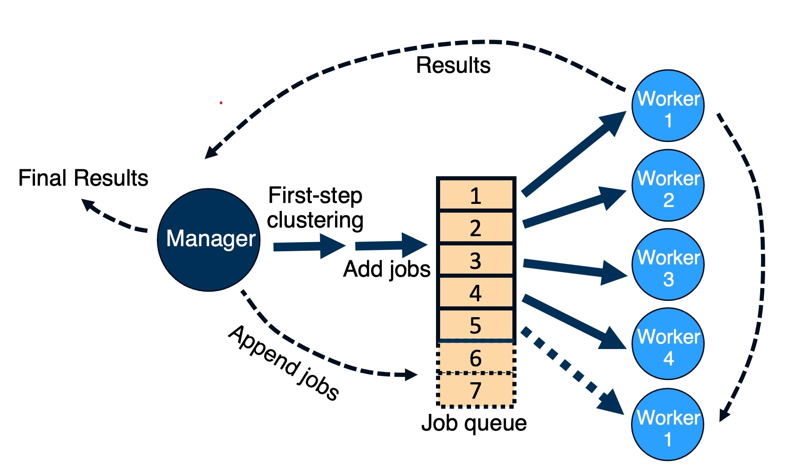
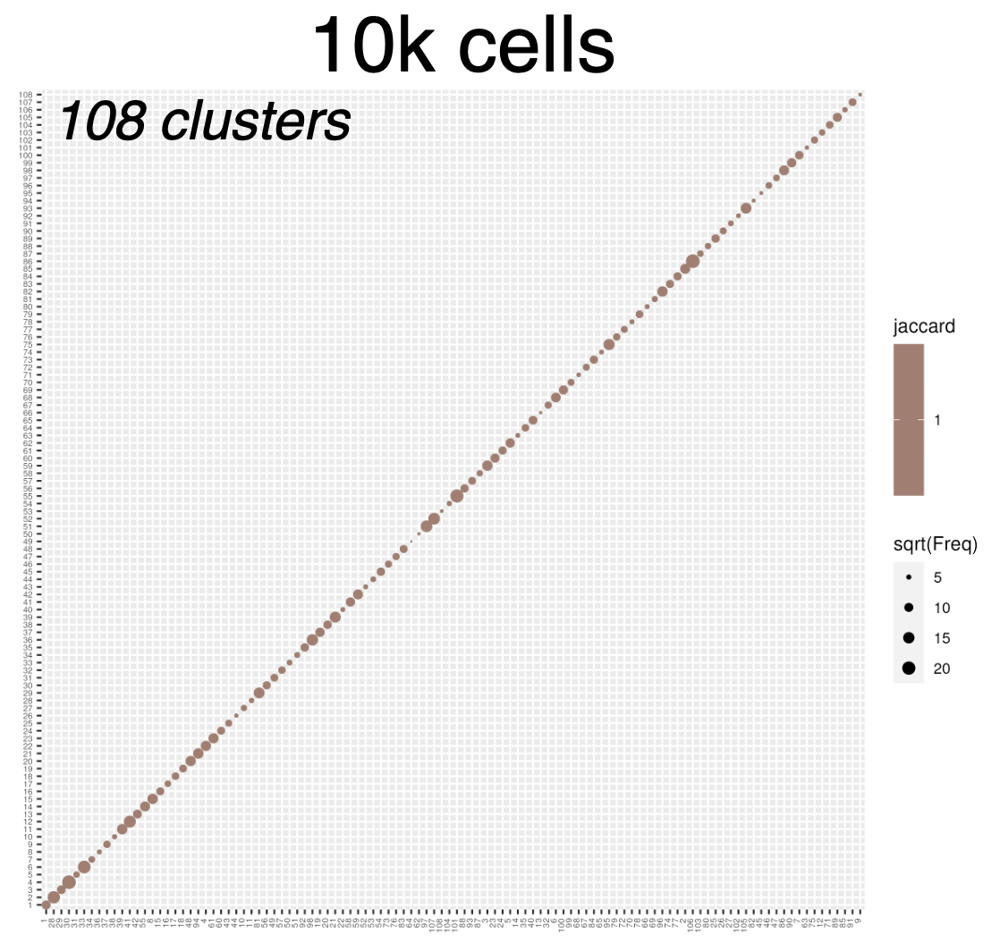
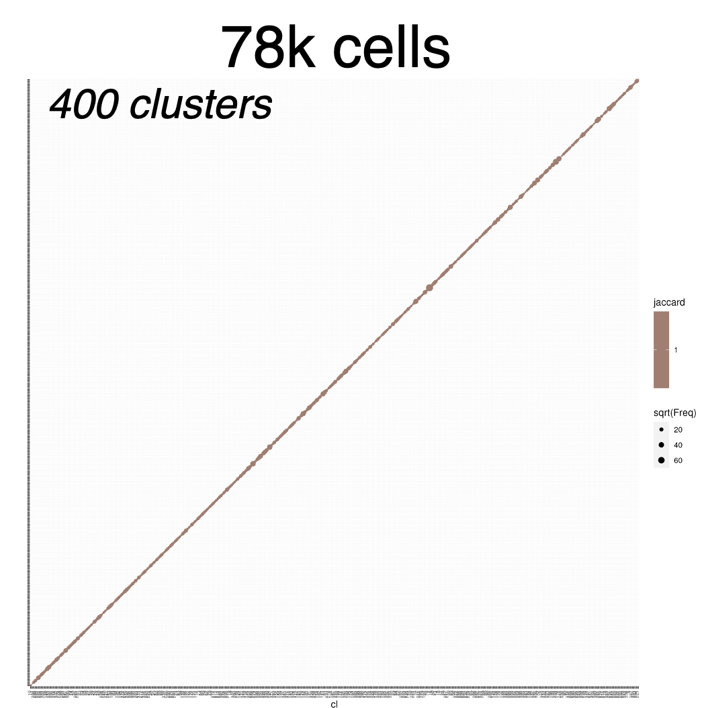
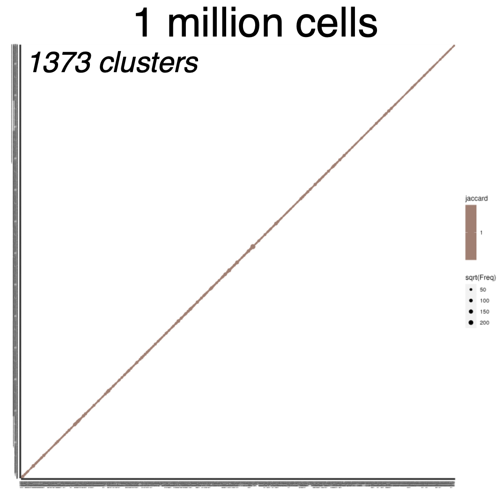

# Accelerating *transcriptomic_clustering* with Distributed Computing


This method implements a **dynamic, asynchronous clustering algorithm** using the **Message-Passing Interface (MPI)** to distribute clustering tasks across multiple HPC nodes. It provides the same clustering results as the transcriptomic_clustering package but is optimized for distributed computating using MPI, significantly reducing the time required to cluster large datasets. 

## Quick Start
1. Modify the `sbatch_mpi.sh` script to specify the number of nodes and any required configuration for your HPC environment. Also, specify the paths to the raw counts (a .h5ad file), the precomputed latent space (a .csv file with cell names as index), the output directory, the manager and the worker scripts, and the clustering parameters. (Optional) Change the conda environment and the path to the trancriptomic_clustering package (if it is not installed in the same conda enviroment). See requirements.txt for building your own conda enviroment.
2. Submit the job to your HPC using:
   ```bash
   sbatch sbatch_mpi.sh

## Background
The transcriptomic clustering Python package that uses a **scVI latent space** can be found here: [transcriptomic_clustering](https://github.com/AllenInstitute/transcriptomic_clustering/tree/hmba/tc_latent). It is the Python version of the R package [scrattch.hicat](https://github.com/AllenInstitute/scrattch.hicat), both of which perform clustering recursively (depth-first search). The recursive approach can take significant time for large datasets. For instance, clustering 1 million cells can take ~2 days.

## Distributed Clustering Model
This method replaces the depth-first search (DFS) recursive method with a **dynamic, asynchronous manager-worker model**:
- **Manager Node**: Oversees the clustering process, distributing jobs to worker nodes and managing the queue of tasks.
- **Worker Nodes**: Independently perform clustering tasks and, once a job finishes, immediately taking a job from the queue and performing clustering again.
- **Asynchronous Task Distribution**: The system doesn’t wait for all clustering jobs at the same hierarchy to finish before moving on. Instead, as soon as a worker node completes its current job, it directly moves to the next pending task in the queue.

### How It Works



- **Step 1**: The manager node performs the initial clustering task. Once that finishes, the manager node appends all subsequent clustering jobs for each cluster into the job queue. For each available worker node, the manager assigns a job from the queue.
- **Step 2**: Each worker node performs its assigned clustering task.
- **Step 3**: Once a worker finishes, it sends the result to the manager and immediately takes a pending job from the queue. The manager evaluate the clusters:
  - for clusters that cannot be further clustered (clustered into 1 cluster), the results are added to the final results.
  - for clusters that can be furtehr clustered (clustered into > 1 clusters), the subclusters are added to the queue for further clustering.
- **Step 4**: The process continues until the job queue is empty and all nodes have terminated.

## Benchmarking Results
### Run time comparison
The table below shows the comparison of run time between the transcriptomic_clustering package and hicatMPI.
| Number of Cells | transcriptomic_clustering | hicatMPI (This Method)|
|-----------------|---------------------------|-----------------------|
| 10,000          | 12 minutes                | 9 minutes             |
| 80,000          | 63 minutes                | 18 minutes            |
| 1,000,000       | 47 hours 41 minutes       | 2 hours 15 minutes    |

### Clustering results comparison
The confusion matrices below shows the clustering results from the transcriptomic_clustering package (y axis) and hicatMPI (x axis) for clustering 10k cells (left), 78k cells (middle), and 1 million cells (right). The 1-1 correspondence confirms that the same clustering results are obtained from both the original transcriptomic_clustering package and this MPI-based implementation, given the same data input and clustering parameters.

  
